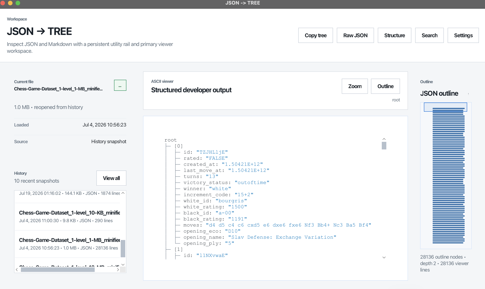

# json-tree

Desktop application for visualizing JSON files as ASCII trees with syntax highlighting, built with **JavaFX 21** + **Spring Boot 3.3** + **Java 22**.



## 🎯 Overview

**json-tree** is a lightweight, developer-friendly desktop tool that transforms JSON files into readable ASCII tree structures. Drop a file, validate it, render it, and browse your JSON like a pro—all with zero database dependencies.

### Key Features

- **📁 Drag-and-Drop Import** — Drop any JSON file anywhere on the window to load, validate, and render instantly.
- **🌳 ASCII Tree Rendering** — Deterministic, monospace-friendly tree layout with proper alignment for nested structures.
- **✨ Syntax Highlighting** — Color-coded tokens (keys, strings, numbers, booleans, nulls, arrays).
- **📜 Scrollable Viewer** — Horizontal and vertical scrolling for large JSON documents.
- **💾 Local Snapshots** — Automatic history of imported files with metadata (size, timestamp, validity).
- **🔍 Search & Filter** — Find and filter history entries; toggle favorites.
- **⚡ Large File Handling** — Smart preview mode for files exceeding render budget; full render fallback on demand.
- **🎨 Dark Theme** — Minimalist dark interface inspired by developer tools.

---

## 🚀 Getting Started

### Prerequisites

- **Java 22** (or compatible JDK)
- **Maven 3.8+**

### Build & Run

```bash
# Clone the repository
git clone https://github.com/davidpe/json-tree.git
cd json-tree

# Build the application
mvn clean package

# Run the application
mvn javafx:run
```

Or directly run the JAR:
```bash
java -jar target/json-tree-0.0.1-SNAPSHOT.jar
```

---

## 🗂️ Project Structure

```
src/main/java/com/davidpe/jsontree/
├── bootstrap/              # JavaFX + Spring wiring, app entry point
├── application/            # Use cases, ports, orchestration
│   ├── model/             # Domain-agnostic DTOs (JsonViewerLoadResult, etc.)
│   ├── port/              # In/out interfaces (use case contracts)
│   └── service/           # Business logic & workflow services
├── domain/                # Pure domain model (ImportedJsonFile, AsciiTreeDocument, etc.)
├── infrastructure/        # Adapters & persistence
│   ├── config/           # Spring configuration, properties
│   ├── persistence/       # File-based history repository
│   ├── rendering/        # ASCII tree formatting, validation
│   └── ui/               # UI infrastructure (executors, icon factories)
└── ui/                   # JavaFX controllers & screen management
    ├── controller/       # Screen logic (MainScreenController, HistoryScreenController, etc.)
    ├── screen/          # Screen lifecycle & navigation
    └── support/         # UI helpers (formatters, resolvers, state presenters)

src/main/resources/
└── com/davidpe/jsontree/ui/
    ├── *.fxml            # JavaFX layouts
    └── styles.css        # Dark theme styling
```

### Architecture Principles

- **Hexagonal (Ports & Adapters)** — Strict separation between domain, application, and infrastructure layers.
- **Dependency Inversion** — All external dependencies (file I/O, rendering engines) are injected via interfaces.
- **Spring-managed Components** — Controllers, services, and factories are Spring beans.
- **No Business Logic in UI Controllers** — Controllers delegate to use cases; state flows through DTOs, not mutable objects.

---

## 🏗️ Technical Stack

| Component | Version | Purpose |
|-----------|---------|---------|
| **Java** | 22 | Language & runtime |
| **JavaFX** | 21.0.9 | Desktop UI framework |
| **Spring Boot** | 3.3.2 | Dependency injection, lifecycle management |
| **Jackson** | 2.17.1 | JSON parsing & validation |
| **RichTextFX** | 0.11.1 | Syntax-highlighted text area |
| **JUnit 5** | 5.10.2 | Unit testing framework |
| **Maven** | 3.8+ | Build & dependency management |

---

## 💡 Core Workflows

### 1. Import & Validate JSON

```
User drags file
    ↓
ClipboardJsonImportService reads file → size, path, validity
    ↓
JacksonJsonValidationService validates with Jackson
    ↓
Result: JsonImportResult with validation metadata
```

### 2. Render ASCII Tree

```
Valid JSON detected
    ↓
JsonViewerWorkflowService coordinates render
    ↓
AsciiTreeFullRenderGuard checks if tree size exceeds budget
    ↓
If exceeds: LargePreviewSessionService materializes chunked preview
    ↓
If within budget: JacksonAsciiTreeFormatter renders full tree
    ↓
Result: AsciiTreeDocument (content, lineCount, rootLabel)
```

### 3. History Management

```
File rendered → automatically saved to app-data/history/
    ↓
Name: TIMESTAMP_sanitized-filename.json
    ↓
Metadata persisted in app-data/metadata.json
    ↓
HistoryScreenController loads & displays entries
    ↓
User can reopen, delete, or toggle favorites
```

---

## 📊 Data Models

### AsciiTreeDocument
```java
record AsciiTreeDocument(
    String rootLabel,      // Top-level key for root node
    String content,        // ASCII tree string
    int lineCount          // Number of lines for rendering budget
)
```

### ImportedJsonFile
```java
record ImportedJsonFile(
    String storedName,     // Timestamp-prefixed filename
    String originalName,   // User-friendly name
    Instant importedAt,    // Import timestamp
    long sizeBytes,        // File size
    int lineCount,         // Rendered ASCII lines
    boolean valid,         // Validation result
    boolean favorite       // User-marked favorite
)
```

### JsonViewerLoadResult
```java
record JsonViewerLoadResult(
    JsonImportResult importResult,           // Import metadata
    JsonValidationResult validationResult,   // Validation outcome
    Optional<AsciiTreeDocument> document,    // Rendered tree (if valid)
    JsonViewerVisualState visualState        // UI state (EMPTY, VALID, INVALID, etc.)
)
```

---

## ⚙️ Configuration

Configuration is managed via `application.yml`:

```yaml
json-tree:
  large-preview:
    # Bytes threshold for triggering large-preview mode
    fullRenderMaxBytes: 1048576  # 1 MB
    
    # Max lines to show in preview
    previewMaxLines: 400
    
    # Page line count for chunked rendering
    pageLineCount: 400
    
    # Warm cache radius (nearby pages)
    warmPageRadius: 20
    
    # Budget for JavaFX text nodes per render
    textNodeBudget: 25000
```

---

## 🧪 Testing

```bash
# Run all tests
mvn test

# Run specific test class
mvn test -Dtest=SearchMatchProjectorTest

# Run with coverage
mvn test jacoco:report coverage:report
```

### Key Test Suites

- **ClipboardJsonImportServiceTest** — File import, validation, metadata extraction
- **HistoryJsonImportServiceTest** — History snapshot creation, serialization
- **SearchMatchProjectorTest** — History search term matching
- **AppSmokeTest** — End-to-end integration test (Spring context load, UI launch)

---

## 📝 History & Persistence

History is **file-based**, not database-backed:

```
app-data/
├── metadata.json              # Index of all imported files
├── history/
│   ├── 2026-07-19_01-16-02_file1.json
│   ├── 2026-07-19_01-16-55_file2.json
│   └── ...
└── large-preview-settings.properties  # Cached large-preview config
```

The `metadata.json` contains:
```json
{
  "imported_files": [
    {
      "storedName": "2026-07-19_01-16-02_file1",
      "originalName": "large-file.json",
      "importedAt": "2026-07-19T01:16:02Z",
      "sizeBytes": 5242880,
      "lineCount": 8456,
      "valid": true,
      "favorite": false
    }
  ]
}
```

---

## 🎨 UI Screens

### Main Screen (MainScreenController)
- **Drag-and-drop zone** for JSON import
- **ASCII tree viewer** with syntax highlighting
- **Status bar** showing import result & validation state
- **Navigation buttons** to history screen

### History Screen (HistoryScreenController)
- **Filterable list** of past imports
- **Search by filename**
- **Favorites filter** toggle
- **Reopen** entry, **delete**, or **mark as favorite**
- **Metadata display** (size, import time, validity)

### Settings Screen (SettingsScreenController)
- **Large preview budget** adjustments
- **Cache settings**
- **Theme preferences** (planned)

---

## 🔌 Extension Points

### Custom Renderers
Implement `AsciiTreeRendererPort` to provide alternative tree rendering logic:
```java
public interface AsciiTreeRendererPort {
    AsciiTreeDocument render(Path jsonFilePath);
}
```

### Custom Validators
Implement `JsonValidationPort` for plug-in validation engines:
```java
public interface JsonValidationPort {
    JsonValidationResult validate(Path path);
}
```

### History Storage
Implement `JsonHistoryRepository` for alternative persistence (database, cloud, etc.):
```java
public interface JsonHistoryRepository {
    List<ImportedJsonFile> findAll();
    void save(ImportedJsonFile entry, String content);
}
```

---

## 📦 Dependencies & Licenses

| Dependency | Version | License |
|-----------|---------|---------|
| Spring Boot | 3.3.2 | Apache 2.0 |
| JavaFX | 21.0.9 | GPL v2 w/ CPE |
| Jackson | 2.17.1 | Apache 2.0 |
| RichTextFX | 0.11.1 | BSD 2-Clause |
| JUnit | 5.10.2 | EPL 2.0 |

---

## 🐛 Known Limitations

- **Max Tree Size** — Trees exceeding `textNodeBudget` (default: 25,000 nodes) trigger large-preview mode.
- **No Network Import** — Only local file import via drag-and-drop.
- **No Real-time Sync** — History updates require app restart to reload metadata.
- **Single-threaded Rendering** — Large files may briefly freeze the UI.

---

## 🚦 Roadmap

- [ ] **CLI Mode** — Command-line JSON-to-ASCII rendering
- [ ] **Format Customization** — User-configurable tree symbols `├─`, `└─`, etc.
- [ ] **Export Options** — Save tree as text, SVG, or HTML
- [ ] **Diff Mode** — Compare two JSON files side-by-side
- [ ] **Plugin System** — Custom validators, renderers, transformers
- [ ] **Cross-Platform Packaging** — Native installers (.exe, .dmg, .deb)

---

## 🤝 Contributing

Contributions are welcome! Follow the project's layered architecture:

1. **Domain logic** → pure model in `domain/`
2. **Business workflows** → `application/service/` with port contracts
3. **Adapters & I/O** → `infrastructure/`
4. **UI** → `ui/controller/` delegating to use cases

Before submitting a PR:
- Run `mvn clean test` to ensure all tests pass
- Keep commits focused and well-described
- Follow existing code style and naming conventions

---

## 📄 License

This project is licensed under the **MIT License**. See [LICENSE](LICENSE) for details.

---

## 👤 Author

**David Pereira**  
[GitHub](https://github.com/davidpe) | [Email](mailto:davidpe@example.com)

---

## 🤓 FAQ

**Q: Why not use a web-based tool?**  
A: Desktop apps provide better performance for large files and a snappier UX without browser overhead.

**Q: Can I edit the JSON?**  
A: Not yet—json-tree is currently read-only. Editing is planned for a future release.

**Q: What's the max file size?**  
A: Theoretically unlimited, but rendering gets chunked above 1 MB (configurable). Performance depends on your machine.

**Q: How are files stored?**  
A: Locally under `app-data/history/` as-is; no upload or cloud sync.

---

## 🐞 Reporting Issues

Found a bug? Open an [issue](https://github.com/davidpe/json-tree/issues) with:
- [ ] Steps to reproduce
- [ ] Expected vs. actual behavior
- [ ] System info (OS, Java version, file size if applicable)
- [ ] Exception trace (if applicable)

---

## ✨ Acknowledgments

- Inspired by command-line JSON viewers like `jq` and `fx`.
- Built with ❤️ using Spring Boot and JavaFX.
- Designed for developers, by developers.
